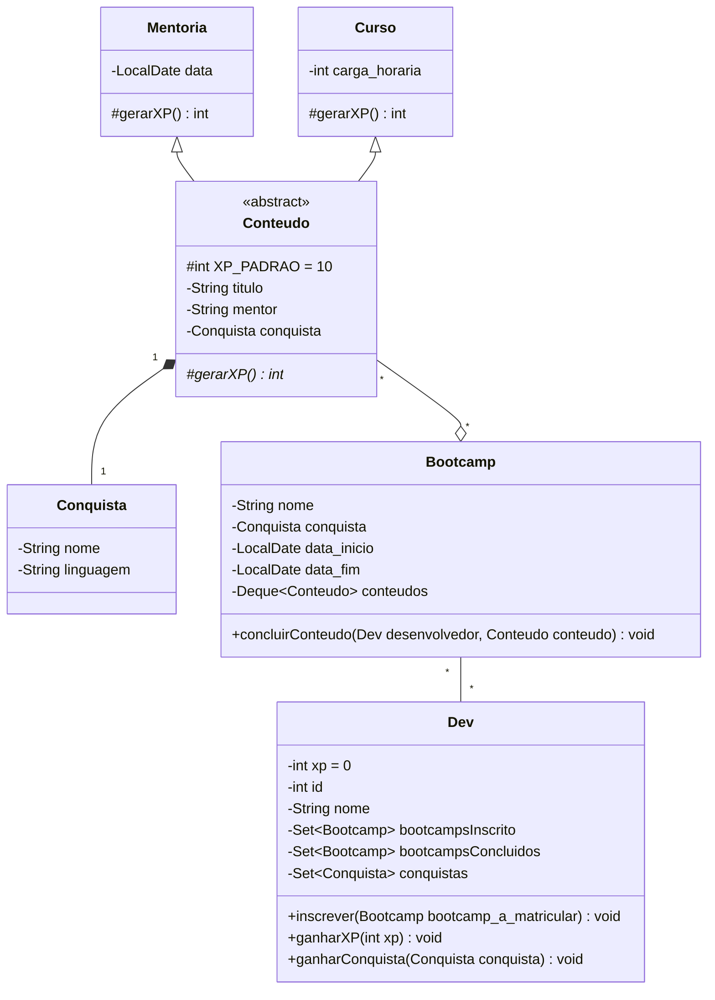

# Bootcamps com POO

Este pequeno projeto simula um sistema de ensino com bootcamps contendo pequenos cursos.

## Tecnologias

* Java 21

## Diagrama de Classes

## Contato

* Luan T. Felix - [lutavares.bros@gmail.com](mailto:lutavares.bros@gmail.com)
* [LinkedIn](https://www.linkedin.com/in/luan-tavares-felix-24273a289/)